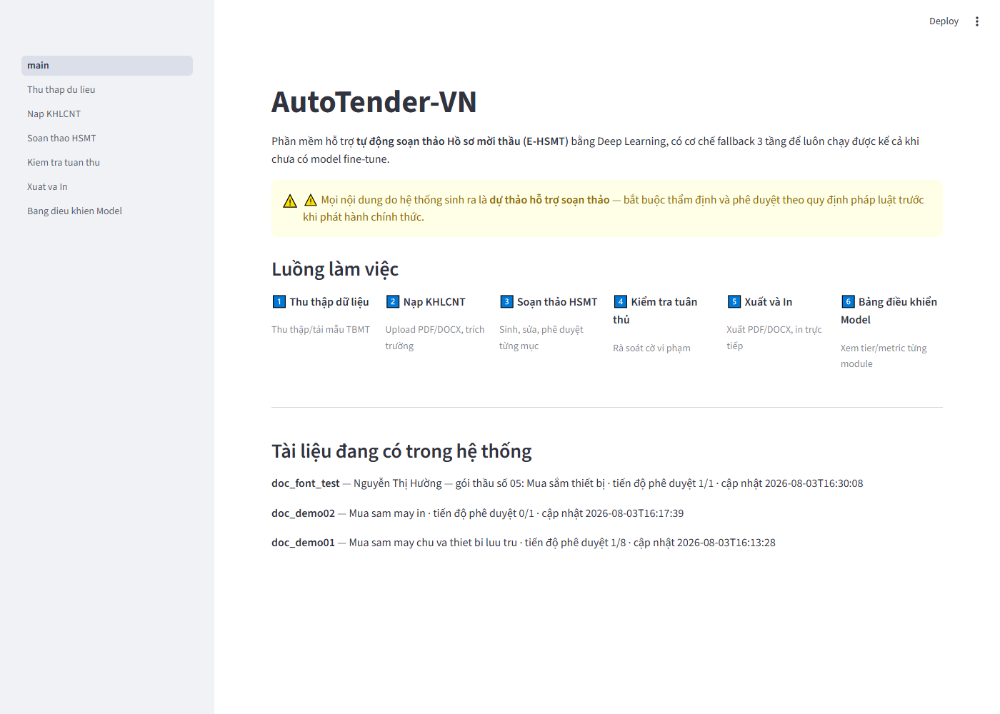
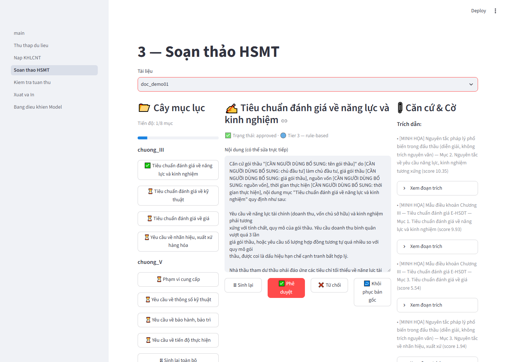
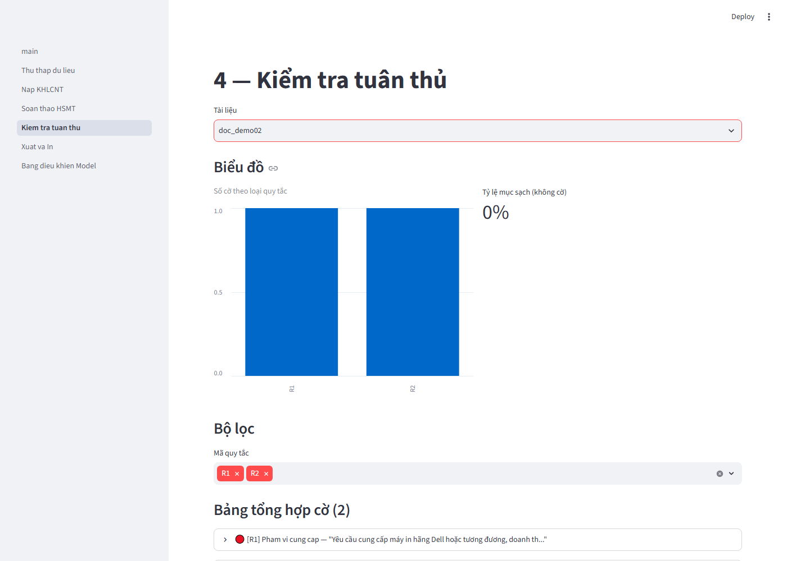
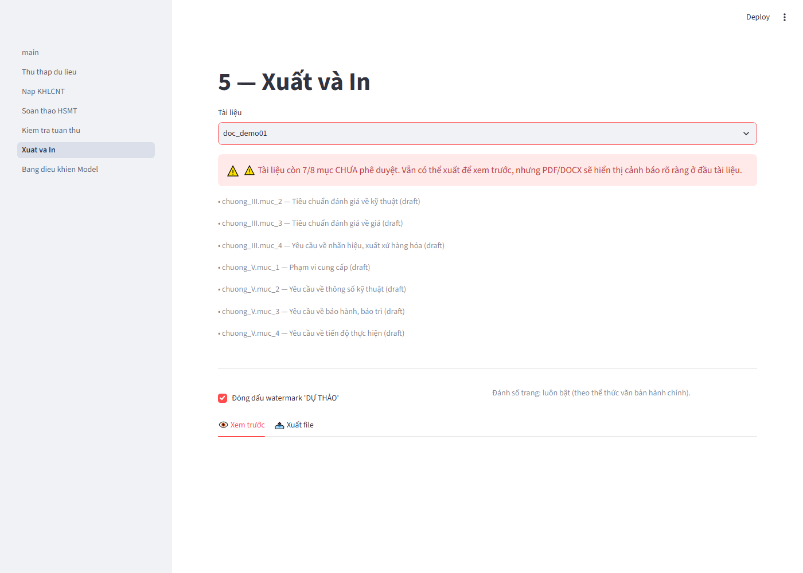

# AutoTender-VN

Phần mềm hỗ trợ **tự động soạn thảo Hồ sơ mời thầu (E-HSMT)** tại Việt Nam bằng Deep
Learning — đồ án cuối môn Deep Learning, bậc Thạc sĩ, thực hiện trong 7 ngày.

Xem đặc tả đầy đủ tại [`docs/SPEC.md`](docs/SPEC.md).

> ⚠️ **Mọi nội dung do hệ thống sinh ra là dự thảo hỗ trợ soạn thảo** — bắt buộc thẩm
> định và phê duyệt theo quy định pháp luật trước khi phát hành chính thức. Xem
> [Nguyên tắc bắt buộc](#nguyên-tắc-thiết-kế-bắt-buộc) bên dưới.

---

## Ảnh chụp màn hình

| Trang chủ | Soạn thảo HSMT |
|---|---|
|  |  |

| Kiểm tra tuân thủ | Xuất và In |
|---|---|
|  |  |

---

## Cài đặt

Yêu cầu Python 3.10+.

```bash
python -m venv .venv
# Windows
.venv\Scripts\activate
# macOS/Linux
source .venv/bin/activate

pip install -r requirements.txt
```

**Ghi chú cài đặt:**
- `paddleocr`/`paddlepaddle` (OCR) có thể không cài được trên một số máy — không sao,
  hệ thống tự động bỏ qua OCR và chỉ nhận PDF có text layer (xem `ingest/ocr.py`).
- `weasyprint` cần thư viện hệ thống GTK; nếu thiếu (phổ biến trên Windows), phần mềm
  **tự động fallback sang ReportLab** — không cần cài thêm gì, PDF vẫn xuất được đúng
  dấu tiếng Việt (xem `export/pdf.py`).
- `playwright` (crawler dự phòng): sau khi `pip install`, chạy thêm
  `playwright install chromium` nếu muốn dùng `MSCBrowserSource`.

## Chạy ứng dụng

```bash
streamlit run app/main.py
```

Mở trình duyệt tại `http://localhost:8501`. Lần đầu chạy sẽ chưa có tài liệu nào — vào
**Trang 2 (Nạp KHLCNT)** để bắt đầu, hoặc **Trang 1 (Thu thập dữ liệu)** với nguồn
`local` để nạp 20 bản ghi mẫu.

**Chạy được cả khi thư mục `models/` trống** (không có checkpoint Tier 1 nào) — đây là
yêu cầu cốt lõi của đồ án (xem Degraded Mode bên dưới).

## Chạy test

```bash
pytest
```

49 test, bao gồm cả test tích hợp Streamlit (dùng `streamlit.testing.v1.AppTest`) và
test bắt buộc render đúng dấu tiếng Việt trong PDF.

---

## Kiến trúc hệ thống

```
Crawler (M0) ─▶ Ingestion (M1) ─▶ NER (M2) ─▶ Classifier (M3)
                                       │
                                       ▼
                              RAG Retrieval (M4)
                                       │
                                       ▼
                              Generator (M5) ─▶ Compliance Guard (M6)
                                       │
                                       ▼
                        HITL Store (SQLite) ◀─▶ Streamlit GUI (6 trang)
                                       │
                                       ▼
                          Export: PDF / DOCX / In trực tiếp
```

Chi tiết từng module: xem Mục 6 của [`docs/SPEC.md`](docs/SPEC.md) và
[`docs/MODEL_CARD.md`](docs/MODEL_CARD.md).

### Nguyên tắc thiết kế bắt buộc

1. **Degraded Mode (3-tier fallback):** mọi module ML (`autotender/models/*.py`) đều kế
   thừa `BaseModule` (`models/base.py`) với 3 tầng: Tier 1 (checkpoint fine-tune) → Tier 2
   (pretrained zero-shot) → Tier 3 (rule-based, luôn thành công). UI hiển thị badge tier
   đang chạy (🟢/🟡/🔵). **Trạng thái hiện tại: cả 5 module đang chạy Tier 3** vì môi
   trường phát triển không có GPU/Colab (xem `docs/MODEL_CARD.md`).
2. **Không bịa đặt:** số liệu (giá gói thầu, thời gian, nguồn vốn) được chèn bằng
   slot-filling từ trường đã trích xuất, không để mô hình sinh tự do; verifier
   `verify_numeric_consistency` (trong `models/generator.py`) tự động gắn cờ `R4` nếu
   phát hiện số liệu không truy vết được nguồn.
3. **Human-in-the-loop:** không mục nào được coi là hoàn thành nếu chưa qua **Phê
   duyệt** (`hitl/store.py`). Xuất PDF/DOCX hiển thị cảnh báo rõ ràng nếu còn mục chưa
   duyệt, kèm phụ lục nhật ký phê duyệt.
4. **Thu thập dữ liệu có trách nhiệm:** crawler tôn trọng `robots.txt`, rate-limit 1
   request/2 giây, User-Agent khai báo rõ mục đích nghiên cứu, cache toàn bộ response
   (xem `crawler/msc_client.py`).

---

## Luồng sử dụng (6 trang)

1. **Thu thập dữ liệu** — crawl TBMT (tự động api → browser → local) hoặc dùng 20 bản
   ghi mẫu có sẵn.
2. **Nạp KHLCNT** — upload PDF/DOCX/dán văn bản, xem trường trích xuất kèm highlight và
   độ tin cậy.
3. **Soạn thảo HSMT** — sinh dự thảo Chương III & V, sửa trực tiếp, so sánh diff, phê
   duyệt/từ chối từng mục.
4. **Kiểm tra tuân thủ** — rà soát cờ vi phạm (R1-R4), lọc theo mã quy tắc, phản hồi
   đúng/dương tính giả.
5. **Xuất và In** — xem trước, xuất PDF/DOCX, in trực tiếp; cảnh báo nếu còn mục chưa
   duyệt.
6. **Bảng điều khiển Model** — xem tier đang chạy + metric từng module (từ
   `reports/metrics.json`).

---

## Kết quả đánh giá

Chạy `python scripts/evaluate.py` để tái tạo `reports/metrics.json` + biểu đồ trong
`reports/figures/`. Tóm tắt (Tier 3, xem giới hạn phương pháp trong
[`docs/DATA_CARD.md`](docs/DATA_CARD.md) và [`docs/MODEL_CARD.md`](docs/MODEL_CARD.md)):

| Module | Metric | Kết quả (Tier 3) | Baseline |
|---|---|---|---|
| M2 NER | entity-F1 | 1.00 | — |
| M3 Classifier | macro-F1 | 0.61 | TF-IDF+LogReg: 0.39 ± 0.15 |
| M4 Retrieval | proxy Recall@5 | 1.00 | BM25 chính là Tier 3 |
| M6 Compliance | F1/lớp | 1.00 (OK, R1, R2, R3) | keyword rules chính là Tier 3 |

**Ablation:** bỏ retrieval → citation 5→0; bỏ M6 → cờ phát hiện 6→0. Chi tiết đầy đủ
trong `reports/metrics.json` và `docs/MODEL_CARD.md`.

---

## Giới hạn đã biết

- **Chưa có checkpoint Tier 1 thật** cho cả 5 module — môi trường phát triển đồ án
  không có GPU/Colab trong phạm vi 7 ngày. Notebooks `notebooks/01-04` đã viết sẵn, sẵn
  sàng chạy trên Colab (xem hướng dẫn trong từng notebook).
- **Crawler thật (`MSCApiSource`)** đã xác định đúng endpoint API nội bộ của
  `muasamcong.mpi.gov.vn` nhưng chưa xác định được hợp đồng payload chính xác (server trả
  400 với mọi payload hợp lý đã thử) — xem chi tiết điều tra trong
  [`docs/DATA_CARD.md`](docs/DATA_CARD.md) mục 2. `LocalSampleSource` (20 mẫu tổng hợp)
  đảm bảo phần mềm luôn demo được.
- **Corpus RAG** là dữ liệu minh hoạ/tổng hợp, không phải văn bản pháp luật thật — xem
  cảnh báo `[MINH HỌA]` hiển thị trên UI và chi tiết trong `docs/DATA_CARD.md` mục 4.
- **`notebooks/05_train_compliance.ipynb`** chưa được tạo (ngoài phạm vi 7 ngày) — cần
  dữ liệu gán nhãn quy mô lớn hơn cho M6, xem `docs/MODEL_CARD.md`.

---

## Cấu trúc thư mục

Xem Mục 4 của [`docs/SPEC.md`](docs/SPEC.md).

## Tài liệu liên quan

- [`docs/SPEC.md`](docs/SPEC.md) — đặc tả đầy đủ (mục tiêu, kiến trúc, kế hoạch 7 ngày)
- [`docs/DATA_CARD.md`](docs/DATA_CARD.md) — nguồn gốc và giới hạn của dữ liệu
- [`docs/MODEL_CARD.md`](docs/MODEL_CARD.md) — kiến trúc, tier, metric từng module ML
