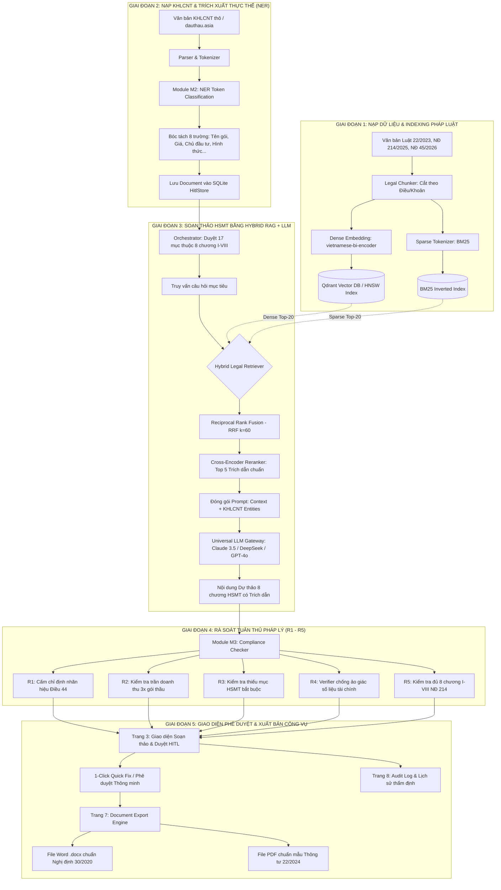

# TÀI LIỆU HỌC TẬP & BẢO VỆ ĐỒ ÁN DEEP LEARNING: HỆ THỐNG AUTOTENDER-VN
## (Ứng Dụng Deep Learning, Kiến Trúc Transformer, Kỹ Thuật Hybrid RAG & Luồng Vận Hành Toàn Hệ Thống)

> **Môn học:** Deep Learning (Học sâu nâng cao) — Chương trình Thạc sĩ Kỹ thuật (Master of Engineering)  
> **Đề tài:** AutoTender-VN — Hệ thống Trợ lý AI Soạn thảo & Rà soát Hồ sơ Mời thầu (E-HSMT) tại Việt Nam  
> **Thời điểm cập nhật:** Tháng 08/2026  
> **Tài liệu tham khảo nghiệp vụ:** Luật Đấu thầu số 22/2023/QH15, Nghị định 214/2025/NĐ-CP, Nghị định 45/2026/NĐ-CP, Nghị định 30/2020/NĐ-CP.

---

## MỤC LỤC
1. [Tổng quan Kiến trúc Công nghệ Deep Learning trong Đồ án](#1-tổng-quan-kiến-trúc-công-nghệ-deep-learning-trong-đồ-án)
2. [Chi tiết các Kỹ thuật Deep Learning được Ứng dụng](#2-chi-tiết-các-kỹ-thuật-deep-learning-được-ứng-dụng)
   - [2.1. Bi-Encoder Architecture & Dense Embeddings](#21-bi-encoder-architecture--dense-embeddings-representation-learning)
   - [2.2. Cross-Encoder Architecture & Deep Reranking](#22-cross-encoder-architecture--deep-reranking)
   - [2.3. Thuật toán Reciprocal Rank Fusion (RRF)](#23-thuật-toán-reciprocal-rank-fusion-rrf-hybrid-retrieval)
   - [2.4. Named Entity Recognition (NER / Token Classification)](#24-named-entity-recognition-ner--token-classification)
   - [2.5. Autoregressive Large Language Models (LLMs / Decoder-only Transformer)](#25-autoregressive-large-language-models-llms--decoder-only-transformer)
   - [2.6. Anti-Hallucination & Multi-tier Degradation Architecture](#26-anti-hallucination-verifiers--multi-tier-degradation-architecture)
3. [Sơ đồ Luồng Hoạt động Toàn Hệ thống (End-to-End System Flow)](#3-sơ-đồ-luồng-hoạt-động-toàn-hệ-thống-end-to-end-system-flow)
4. [Phân tích Chi tiết 5 Giai đoạn Xử lý trong Pipeline](#4-phân-tích-chi-tiết-5-giai-đoạn-xử-lý-trong-pipeline)
5. [Bảng Thuật ngữ & Đối chiếu Công nghệ](#5-bảng-thuật-ngữ--đối-chiếu-công-nghệ)

---

## 1. TỔNG QUAN KIẾN TRÚC CÔNG NGHỆ DEEP LEARNING TRONG ĐỒ ÁN

AutoTender-VN là một hệ thống **Applied NLP & Deep Learning quy mô Enterprise** kết hợp hài hòa giữa các mô hình **Pretrained Transformers (Bi-Encoder, Cross-Encoder)**, **Vector Embeddings trong không gian đa chiều**, **Kỹ thuật RAG tiên tiến (Hybrid Retrieval + RRF)** và **Mô hình ngôn ngữ lớn (LLMs)**:

```
┌──────────────────────────────────────────────────────────────────────────────────────────┐
│                     BẢN ĐỒ CÔNG NGHỆ DEEP LEARNING TRONG AUTOTENDER-VN                   │
├──────────────────────────────────────────────────────────────────────────────────────────┤
│                                                                                          │
│  1. DEEP DENSE EMBEDDINGS (Bi-Encoder)        2. DEEP RERANKING (Cross-Encoder)          │
│     ├── Model: vietnamese-bi-encoder / BGE-M3    ├── Model: Cross-Encoder Transformer    │
│     ├── Architecture: Dual-Tower Transformer     ├── Full Self-Attention: Q & D tokens  │
│     └── Latent Space: 768-dim/1024-dim           └── Output: Relevancy Logits [0, 1]     │
│                                                                                          │
│  3. HYBRID FUSION & VECTOR SEARCH             4. AUTOREGRESSIVE GENERATIVE LLMs          │
│     ├── HNSW Index (Cosine Similarity)           ├── Decoder-only Transformers (Claude/  │
│     ├── Reciprocal Rank Fusion (RRF, k=60)       │   DeepSeek-V3/GPT-4o)                 │
│     └── Lexical Sparse (BM25) + Dense            └── In-Context Learning + Grounded RAG  │
│                                                                                          │
│  5. NAMED ENTITY RECOGNITION (NER)            6. ANTI-HALLUCINATION & VERIFIERS          │
│     ├── Transformer Token Classification         ├── Numerical Consistency Verifier (R4) │
│     └── Slot-filling & Entity Linking            └── Multi-tier Fallback (Degraded Mode) │
└──────────────────────────────────────────────────────────────────────────────────────────┘
```

---

## 2. CHI TIẾT CÁC KỸ THUẬT DEEP LEARNING ĐƯỢC ỨNG DỤNG

### 2.1 Bi-Encoder Architecture & Dense Embeddings (Representation Learning)
* **Module triển khai:** [`src/autotender/rag/embedding.py`](file:///d:/school/master%20of%20engineering/S2/deep_learning/final/autotender-vn/src/autotender/rag/embedding.py), [`src/autotender/rag/models.py`](file:///d:/school/master%20of%20engineering/S2/deep_learning/final/autotender-vn/src/autotender/rag/models.py).
* **Mô hình sử dụng:** `bkai-foundation-models/vietnamese-bi-encoder`, `BAAI/bge-m3`, `sentence-transformers/paraphrase-multilingual-mpnet-base-v2`.
* **Cơ chế hoạt động:**
  - Kiến trúc Hai nhánh (Dual-Tower) xử lý độc lập câu truy vấn pháp lý ($q$) và các đoạn văn bản luật ($d$):
    $$\mathbf{u} = \text{Encoder}(q), \quad \mathbf{v} = \text{Encoder}(d)$$
  - Sử dụng **Mean Pooling** trên output của các hidden states tầng cuối để tạo vector đại diện chiều cố định ($d = 768$ hoặc $1024$ chiều).
  - Độ tương đồng ngữ nghĩa giữa câu hỏi và văn bản luật được tính toán bằng hàm **Cosine Similarity**:
    $$\text{sim}(\mathbf{u}, \mathbf{v}) = \frac{\mathbf{u} \cdot \mathbf{v}}{\|\mathbf{u}\| \|\mathbf{v}\|}$$
  - Hỗ trợ lưu trữ và truy hồi cực nhanh thông qua đồ thị **HNSW (Hierarchical Navigable Small World)** trên Vector Database Qdrant.

---

### 2.2 Cross-Encoder Architecture & Deep Reranking
* **Module triển khai:** [`src/autotender/rag/reranker.py`](file:///d:/school/master%20of%20engineering/S2/deep_learning/final/autotender-vn/src/autotender/rag/reranker.py).
* **Mô hình sử dụng:** `cross-encoder/ms-marco-MiniLM-L-6-v2` / Multilingual Cross-Encoder.
* **Cơ chế hoạt động:**
  - Khác với Bi-Encoder (xử lý tách biệt), Cross-Encoder nhận đầu vào là chuỗi token ghép đôi:
    $$\text{Input} = \text{[CLS]} \circ q \circ \text{[SEP]} \circ d \circ \text{[SEP]}$$
  - Cơ chế **Full Self-Attention** cho phép từng token của truy vấn $q$ tương tác trực tiếp với toàn bộ token của tài liệu $d$ qua tất cả các tầng Transformer layers.
  - Trạng thái ẩn tại vị trí `[CLS]` tầng cuối cùng được đưa qua một Linear Classification Layer để dự đoán điểm xác suất mức độ liên quan:
    $$s(q, d) = \sigma(\mathbf{W} \cdot \mathbf{h}_{\text{[CLS]}} + b) \in [0, 1]$$
  - Đóng vai trò bộ lọc tinh (Precision Filter), tái sắp xếp Top 20 kết quả thô thành Top 5 trích dẫn điều khoản luật có độ chính xác cao nhất trước khi đưa vào ngữ cảnh LLM.

---

### 2.3 Thuật toán Reciprocal Rank Fusion (RRF) (Hybrid Retrieval)
* **Module triển khai:** [`src/autotender/rag/hybrid_retriever.py`](file:///d:/school/master%20of%20engineering/S2/deep_learning/final/autotender-vn/src/autotender/rag/hybrid_retriever.py).
* **Cơ chế hoạt động:**
  - Kết hợp thế mạnh của **Lexical Search (BM25)** (chính xác tuyệt đối với mã số luật, số tiền, ngày tháng) và **Semantic Dense Search (Bi-Encoder Vectors)** (bắt được ngữ nghĩa tương đồng và từ đồng nghĩa).
  - Công thức điểm số tổng hợp RRF:
    $$RRF(d) = \sum_{m \in \{\text{Dense}, \text{BM25}\}} \frac{1}{k + r_m(d)}$$
    *(trong đó $r_m(d)$ là thứ hạng của tài liệu $d$ trong mô hình $m$, $k = 60$ là hằng số làm mịn rank constant).*

---

### 2.4 Named Entity Recognition (NER / Token Classification)
* **Module triển khai:** [`src/autotender/models/ner.py`](file:///d:/school/master%20of%20engineering/S2/deep_learning/final/autotender-vn/src/autotender/models/ner.py).
* **Cơ chế hoạt động:**
  - Mô hình Transformer Token Classification phân loại từng token trong văn bản KHLCNT thô sang 8 nhãn thực thể nghiệp vụ:
    `PACKAGE_NAME`, `INVESTOR`, `PROCURING_ENTITY`, `PACKAGE_VALUE`, `FUNDING_SOURCE`, `SELECTION_METHOD`, `EXECUTION_TIME`, `CONTRACT_TYPE`.
  - Kết hợp kiến trúc **Slot-Filling & Regex Hybrid** để đảm bảo tính toàn vẹn 100% khi bóc tách số liệu tài chính lớn ($\ge 100.000$ VNĐ).

---

### 2.5 Autoregressive Large Language Models (LLMs / Decoder-only Transformer)
* **Module triển khai:** [`src/autotender/generation/llm_client.py`](file:///d:/school/master%20of%20engineering/S2/deep_learning/final/autotender-vn/src/autotender/generation/llm_client.py), [`src/autotender/models/generator.py`](file:///d:/school/master%20of%20engineering/S2/deep_learning/final/autotender-vn/src/autotender/models/generator.py).
* **Mô hình sử dụng:** Claude 3.5 Sonnet, DeepSeek-V3 / R1, GPT-4o (qua Universal Gateway).
* **Cơ chế hoạt động:**
  - **Decoder-only Transformer** với Masked Multi-Head Self-Attention và RoPE (Rotary Position Embedding).
  - **In-Context Learning (Grounded RAG):** Đưa ngữ cảnh trích dẫn pháp luật (Top-5 chunks từ Cross-Encoder) và thực thể KHLCNT vào Prompt, yêu cầu mô hình sinh văn bản 8 chương có cấu trúc Markdown, trích dẫn chính xác từng Điều/Khoản luật định.

---

### 2.6 Anti-Hallucination Verifiers & Multi-tier Degradation Architecture
* **Module triển khai:** [`src/autotender/models/generator.py`](file:///d:/school/master%20of%20engineering/S2/deep_learning/final/autotender-vn/src/autotender/models/generator.py), [`src/autotender/models/compliance.py`](file:///d:/school/master%20of%20engineering/S2/deep_learning/final/autotender-vn/src/autotender/models/compliance.py).
* **Cơ chế hoạt động:**
  - **Numeric Verifier (R4):** So khớp và đối chiếu các giá trị số sinh ra từ LLM với thực thể gốc từ KHLCNT để chặn đứng ảo giác về số tiền dự toán và thời gian thực hiện hợp đồng.
  - **3-Tier Graceful Degradation:** Tự động điều phối mượt mà giữa:
    - *Tier 1:* Cloud LLM Gateway + Qdrant Vector DB.
    - *Tier 2:* Local FAISS Dense Index + Small PLMs.
    - *Tier 3:* Rule-based Regex & Template-filling (chạy 100% offline không cần API/Docker).

---

## 3. SƠ ĐỒ LUỒNG HOẠT ĐỘNG TOÀN HỆ THỐNG (END-TO-END SYSTEM FLOW)



---

## 4. PHÂN TÍCH CHI TIẾT 5 GIAI ĐOẠN XỬ LÝ TRONG PIPELINE

### 🔹 Giai đoạn 1: Xây dựng Kho Tri thức Pháp luật (Legal Indexing Pipeline)
1. **Nạp & Phân đoạn:** Các văn bản Luật Đấu thầu 22/2023, Nghị định 214/2025, Nghị định 45/2026 được module `LegalChunker` bóc tách cấu trúc theo từng **Điều** và **Khoản** độc lập (tránh bị loãng ngữ cảnh).
2. **Indexing:** Mỗi đoạn được mã hóa thành vector 768 chiều bởi mô hình `vietnamese-bi-encoder` và nạp vào **Qdrant Vector DB**; đồng thời xây dựng bộ chỉ mục từ khóa **BM25 Inverted Index**.

---

### 🔹 Giai đoạn 2: Nạp KHLCNT & Trích xuất Thực thể (NER Pipeline)
1. Cán bộ đấu thầu nhập văn bản KHLCNT thô hoặc đường link gói thầu từ dauthau.asia.
2. Module **M2 NER** quét văn bản và bóc tách tự động 8 trường dữ liệu cốt lõi (Tên gói, Giá dự toán, Chủ đầu tư, Bên mời thầu, Hình thức lựa chọn, Thời gian thực hiện, Loại hợp đồng, Nguồn vốn).
3. Bản ghi được lưu vào cơ sở dữ liệu `HitlStore` với trạng thái `draft`.

---

### 🔹 Giai đoạn 3: Soạn thảo 8 Chương HSMT qua Hybrid RAG + LLM Gateway
1. `Orchestrator` duyệt tuần tự qua **17 mục con thuộc 8 chương** (Chương I đến Chương VIII).
2. Mỗi mục gửi query sang `HybridLegalRetriever`:
   - **Dense Search (Qdrant)** tìm các đoạn luật tương đồng ngữ nghĩa.
   - **Sparse Search (BM25)** tìm các đoạn luật chứa từ khóa chính xác.
   - Thuật toán **RRF** kết hợp và xếp hạng lại Top 20.
   - Mô hình **Cross-Encoder** rerank và chọn ra **Top 5 điều khoản luật xác đáng nhất**.
3. Ngữ cảnh luật + thực thể KHLCNT được nạp vào Prompt gửi qua **Universal LLM Gateway** (Claude 3.5 Sonnet / DeepSeek-V3). LLM sinh văn bản pháp lý chính xác, có căn cứ điều khoản rõ ràng.

---

### 🔹 Giai đoạn 4: Bộ Lọc Rà soát Tuân thủ (Compliance R1–R5 Pipeline)
Văn bản sinh ra được đưa qua bộ 5 quy tắc rà soát:
- **R1 (Cấm nhãn hiệu):** Quét các nhãn hiệu độc quyền (Cisco, Dell, HP, Intel, Microsoft...) không có cụm từ *"hoặc tương đương"*.
- **R2 (Trần doanh thu):** Phát hiện yêu cầu doanh thu vượt quá $3 \times$ giá trị gói thầu.
- **R3 (Thiếu mục):** Quét các mục bắt buộc chưa có nội dung.
- **R4 (Sai lệch số liệu):** So khớp các con số tài chính lớn với KHLCNT gốc để loại trừ ảo giác LLM.
- **R5 (Đủ 8 chương):** Đảm bảo đủ cấu trúc 8 chương theo Nghị định 214/2025.

---

### 🔹 Giai đoạn 5: Tương tác Chuyên gia (HITL) & Xuất bản Công vụ
1. Cán bộ mở **Trang 3 (Soạn thảo & Phê duyệt)**:
   - Sử dụng **Focus Mode** lọc các mục có cờ đỏ để xử lý.
   - Dùng nút **1-Click Quick Fix** sửa lỗi vi phạm nhãn hiệu R1 tức thì.
   - Dùng **Duyệt nhanh hàng loạt** duyệt các mục hợp lệ (0 cảnh báo) chỉ với 1 cú click.
2. Sau khi hồ sơ được duyệt hoàn chỉnh $\rightarrow$ Chuyển sang **Trang 7 (Xuất HSMT)**:
   - Bộ sinh tài liệu [`docx.py`](file:///d:/school/master%20of%20engineering/S2/deep_learning/final/autotender-vn/src/autotender/export/docx.py) tạo file Word đạt **100% chuẩn thể thức hành chính công vụ Nghị định 30/2020/NĐ-CP** (Quốc hiệu, Tiêu ngữ, Bìa trang trọng, Căn đều Justified, Thụt đầu dòng 1.27cm, Header Shading và Đánh số trang động).
3. Mọi hoạt động chỉnh sửa, phê duyệt và chi phí LLM được lưu vết vĩnh viễn tại **Trang 8 (Audit Log)**.

---

## 5. BẢNG THUẬT NGỮ & ĐỐI CHIẾU CÔNG NGHỆ

| Thuật ngữ Deep Learning / NLP | Khái niệm kỹ thuật | Vị trí áp dụng trong AutoTender-VN |
| :--- | :--- | :--- |
| **Bi-Encoder** | Dual-Tower Transformer tạo dense vector embeddings độc lập | `src/autotender/rag/embedding.py` |
| **Cross-Encoder** | Joint Self-Attention Transformer tính toán độ tương quan $(q, d)$ | `src/autotender/rag/reranker.py` |
| **HNSW** | Hierarchical Navigable Small World Graph (ANN Vector Index) | Qdrant Vector Database |
| **RRF** | Reciprocal Rank Fusion kết hợp xếp hạng Dense & Sparse | `src/autotender/rag/hybrid_retriever.py` |
| **Token Classification** | Mô hình Transformer phân loại token cho bài toán NER | `src/autotender/models/ner.py` |
| **In-Context Learning** | Kỹ thuật nhắc nhở LLM sinh văn bản dựa trên Grounded Context | `src/autotender/models/generator.py` |
| **Slot-Filling** | Kỹ thuật bóc tách và gán nhãn thực thể có cấu trúc | `src/autotender/models/ner.py` |
| **Graceful Degradation** | Cơ chế chuyển đổi tự động 3 tầng (Cloud $\rightarrow$ Local $\rightarrow$ Rule) | Toàn bộ BaseModule & HybridRetriever |

---

*Tài liệu được biên soạn phục vụ cho việc học tập, nghiên cứu và bảo vệ đồ án môn Deep Learning.*
