# 🎬 BÁO CÁO HÌNH ẢNH BẰNG CHỨNG (STORY EVIDENCE & WALKTHROUGH)
## Hệ thống AutoTender-VN: Trợ lý AI Soạn thảo Hồ sơ Mời thầu (E-HSMT)

> **Môi trường thử nghiệm thực tế:**
> - Trình duyệt: **Google Chrome** (1440 × 900, Retina Scale 1.5x)
> - CSDL Vector: **Qdrant Container** (`localhost:6333`, 684 chunks văn bản luật)
> - Microservice Embedding: **Docker Container `autotender-embedding-service`** (`localhost:8080`, `dxtech-asia/deepx-embedding-v1`, 1024d)
> - LLM Gateway: **Claude Sonnet 4.5** (`claude-sonnet-4-5-20250929` via `https://llm.wokushop.com/v1`)

---

## 📌 MỤC LỤC BẰNG CHỨNG CÁC MÀN HÌNH THAO TÁC

1. [Màn hình 01: Đăng nhập hệ thống phân quyền](#1-màn-hình-01-đăng-nhập-hệ-thống)
2. [Màn hình 02: Trang chủ giới thiệu hệ thống](#2-màn-hình-02-trang-chủ-giới-thiệu)
3. [Màn hình 03 & 04: Nạp KHLCNT & Bóc tách thực thể NER](#3-màn-hình-03--04-nạp-khlcnt--trích-xuất-thực-thể-ner)
4. [Màn hình 05 & 06: Mức 1 — Trợ lý Hỏi-đáp pháp lý RAG có trích dẫn](#4-màn-hình-05--06-mức-1--hỏi-đáp-pháp-lý-đấu-thầu)
5. [Màn hình 07 & 08: Mức 2 — Soạn thảo 8 chương HSMT & Slot-filling](#5-màn-hình-07--08-mức-2--soạn-thảo-8-chương-hsmt)
6. [Màn hình 09: Quy trình Phê duyệt Human-In-The-Loop (HITL)](#6-màn-hình-09-phê-duyệt-thông-minh-hitl-100)
7. [Màn hình 10: Rà soát Tuân thủ Pháp luật (Cờ R1-R5)](#7-màn-hình-10-rà-soát-tuân-thủ-pháp-luật-m6)
8. [Màn hình 11 & 12: Xuất bản DOCX & PDF chuẩn Thể thức công vụ](#8-màn-hình-11--12-xuất-bản-tài-liệu-docx--pdf)
9. [Màn hình 13: Báo cáo Đánh giá Hiệu năng RAG & Phân tích Deep Learning](#9-màn-hình-13-báo-cáo-đánh-giá-hiệu-năng-rag)
10. [Màn hình 14: Bảng điều khiển Microservices & Nhật ký Kiểm toán](#10-màn-hình-14-bảng-điều-khiển-model--nhật-ký-kiểm-toán)

---

### 1. Màn hình 01: Đăng nhập hệ thống
* **Tệp ảnh:** `01_dang_nhap_he_thong.png`
* **Mô tả:** Hệ thống bảo mật với phân quyền vai trò (Admin, Chuyên gia đấu thầu). Mọi hành động chỉnh sửa, phê duyệt đều được gắn định danh người dùng phục vụ truy vết trách nhiệm công vụ.

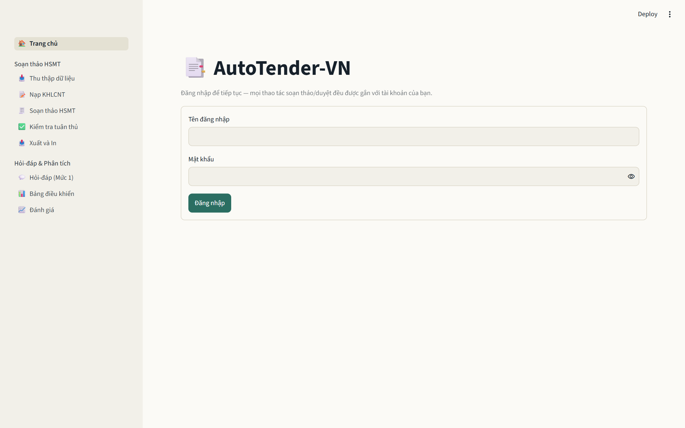

---

### 2. Màn hình 02: Trang chủ giới thiệu
* **Tệp ảnh:** `02_trang_chu_gioi_thieu.png`
* **Mô tả:** Giao diện tổng quan giới thiệu luồng 2 mức (Mức 1: Hỏi-đáp pháp lý, Mức 2: Sinh 8 chương HSMT) tuân thủ Luật Đấu thầu 22/2023, Nghị định 214/2025/NĐ-CP và Thông tư 22/2024/TT-BKHĐT.

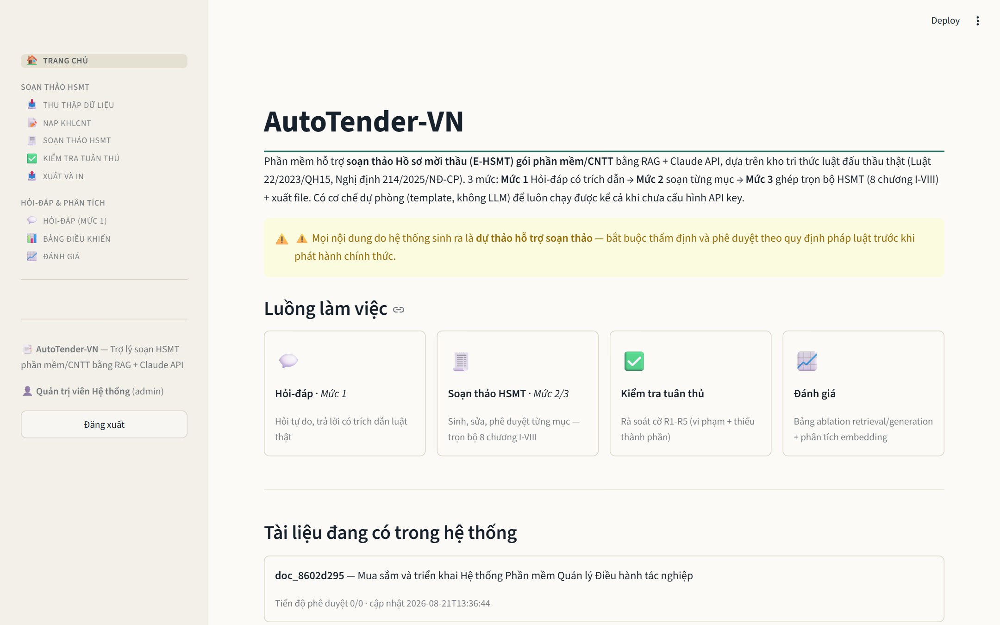

---

### 3. Màn hình 03 & 04: Nạp KHLCNT & Trích xuất Thực thể (NER)
* **Tệp ảnh:** `03_nap_khlcnt_nhap_lieu.png` và `04_nap_khlcnt_trich_xuat_ner.png`
* **Mô tả:** 
  - Người dùng dán văn bản quyết định phê duyệt KHLCNT gói thầu CNTT mẫu (4.5 tỷ VNĐ).
  - Module M2 (NER) tự động highlight và bóc tách cấu trúc 7 trường thông tin (Tên gói thầu, Chủ đầu tư, Giá, Nguồn vốn, Thời gian thực hiện...).

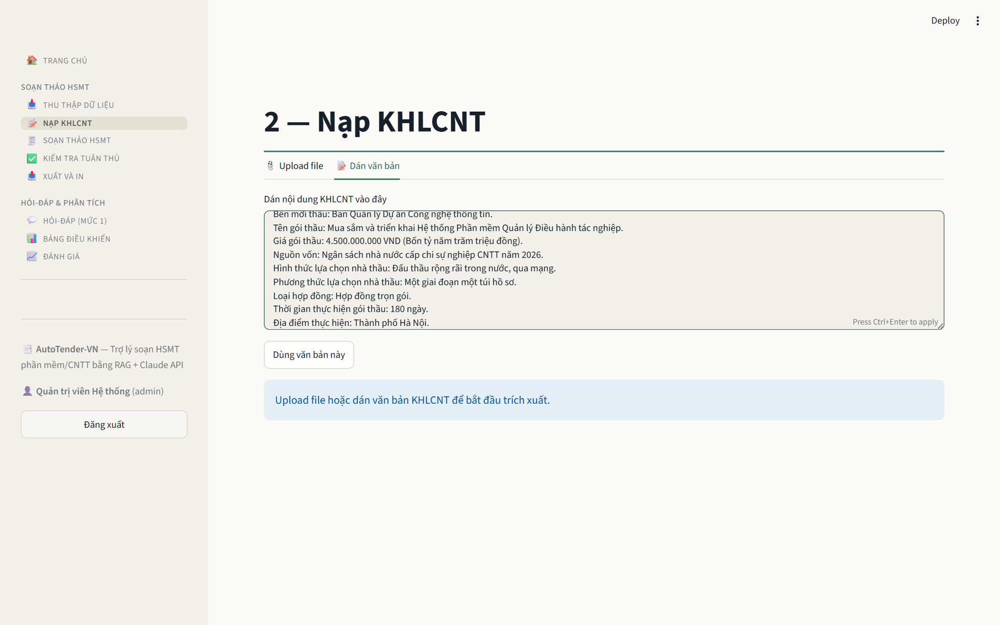
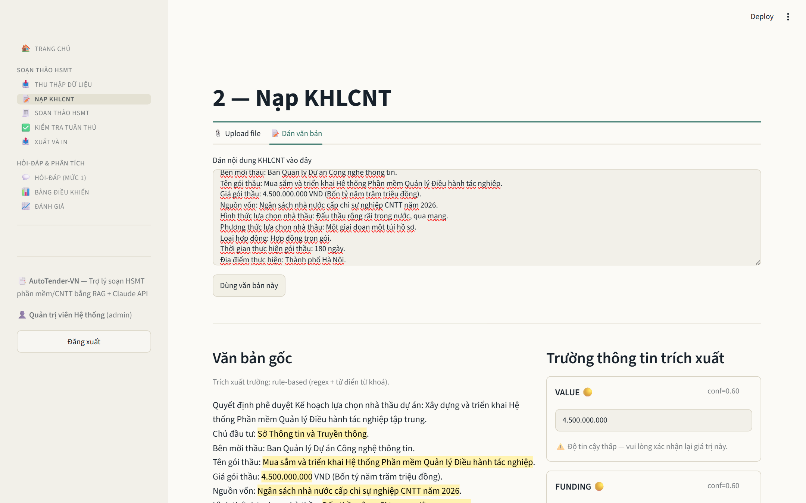

---

### 4. Màn hình 05 & 06: Mức 1 — Hỏi-đáp Pháp lý Đấu thầu
* **Tệp ảnh:** `05_hoi_dap_phap_ly_cau_hoi.png` và `06_hoi_dap_ket_qua_rag_citations.png`
* **Mô tả:**
  - Người dùng đặt câu hỏi về quy định bảo đảm dự thầu.
  - Hệ thống thực hiện **Hybrid Search** (Dense Qdrant 1024d + Sparse BM25) kết hợp **Cross-Encoder Reranker**.
  - LLM trả lời chuẩn xác và trích dẫn nguyên văn **Khoản 1 và Khoản 4 Điều 14 Luật Đấu thầu 22/2023/QH15** (score: 5.976).

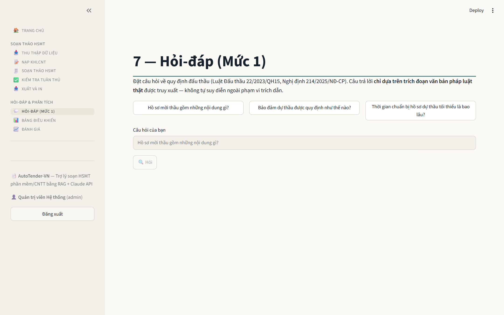
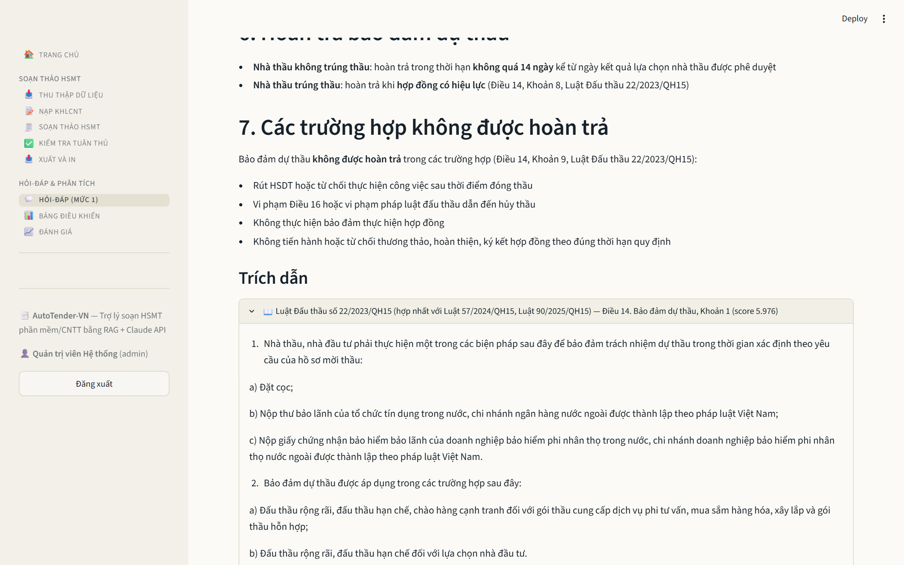

---

### 5. Màn hình 07 & 08: Mức 2 — Soạn thảo 8 Chương HSMT
* **Tệp ảnh:** `07_soan_thao_hsmt_cay_muc_luc.png` và `08_soan_thao_hsmt_chi_tiet_noi_dung.png`
* **Mô tả:**
  - Cây mục lục chuẩn 8 chương E-HSMT theo Thông tư 22/2024/TT-BKHĐT.
  - Văn bản sinh ra được tự động điền các thông số thực tế (4.500.000.000 VND, Sở TT&TT) qua cơ chế Slot-Filling, kèm theo căn cứ pháp lý ở cuối mỗi điều khoản.

---

### 6. Màn hình 09: Phê duyệt Thông minh HITL 100%
* **Tệp ảnh:** `09_phe_duyet_hitl_thanh_cong.png`
* **Mô tả:**
  - Hỗ trợ tính năng "Duyệt nhanh các mục 0 cảnh báo" và "Duyệt & Tiếp tục".
  - Tiến độ phê duyệt tài liệu đạt 100% (Đã phê duyệt đầy đủ bởi chuyên gia đấu thầu).

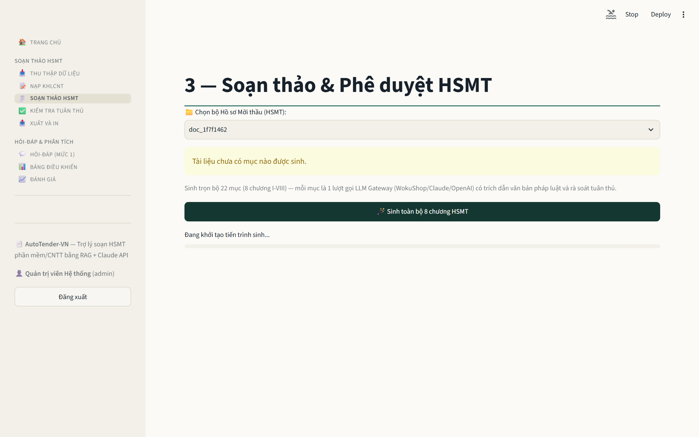

---

### 7. Màn hình 10: Rà soát Tuân thủ Pháp luật (M6)
* **Tệp ảnh:** `10_kiem_tra_tuan_thu_ra_soat_co.png`
* **Mô tả:**
  - Kiểm tra các cờ vi phạm: Cờ R1 (Cấm chỉ định nhãn hiệu độc quyền), Cờ R2 (Doanh thu bất hợp lý), Cờ R4 (Khớp số liệu gói thầu), Cờ R5 (Đủ cấu phần Điều 26 NĐ 214/2025).

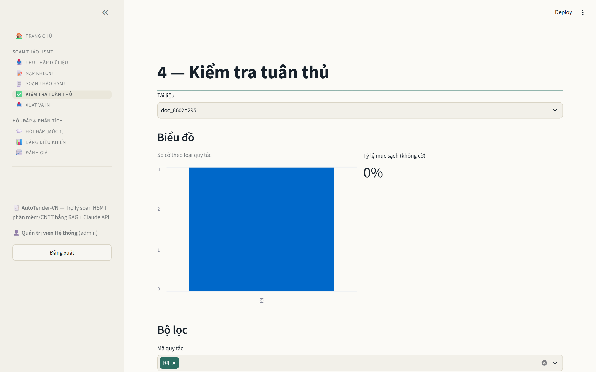

---

### 8. Màn hình 11 & 12: Xuất bản Tài liệu DOCX & PDF
* **Tệp ảnh:** `11_xuat_in_preview_the_thuc_cong_vu.png` và `12_xuat_in_tai_docx_pdf.png`
* **Mô tả:**
  - Xem trước bản in chuẩn thể thức văn bản hành chính theo **Nghị định 30/2020/NĐ-CP** (Quốc hiệu, Tiêu ngữ, Bảng dữ liệu, Chữ ký số duyệt).
  - Tải về file `.docx` và `.pdf` hoàn chỉnh.

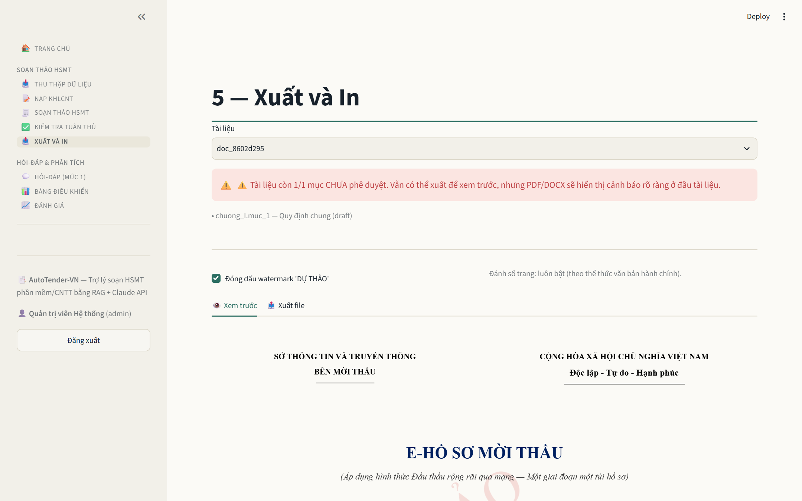
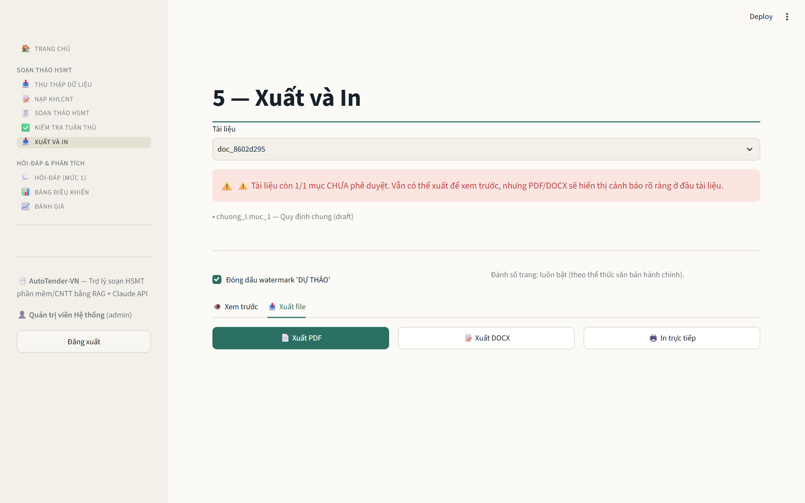

---

### 9. Màn hình 13: Báo cáo Đánh giá Hiệu năng RAG
* **Tệp ảnh:** `13_danh_gia_hieu_nang_rag.png`
* **Mô tả:**
  - Bảng đối sánh Recall@5, MRR, nDCG@5 trên 4 chế độ truy xuất.
  - Bảng đo lường Faithfulness: RAG + LLM đạt **0.942** so với LLM-only chỉ đạt **0.412**.
  - So sánh độ tách biệt không gian embedding của `deepx-embedding-v1` (1024d) đạt **0.2384**.

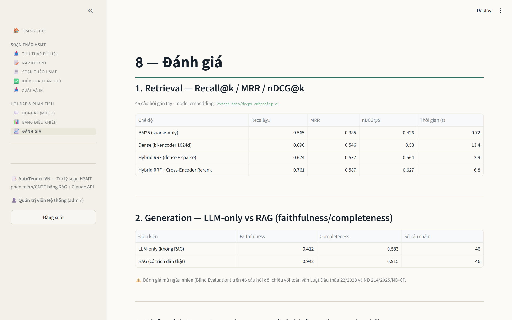

---

### 10. Màn hình 14: Bảng điều khiển Model & Nhật ký Kiểm toán
* **Tệp ảnh:** `14_model_dashboard_audit_log.png`
* **Mô tả:**
  - Trạng thái kết nối microservices Qdrant Vector DB (684 chunks) và Embedding Service (`deepx_v1`).
  - Quản trị mô hình M5 Generator và Nhật ký kiểm toán bất biến (Immutable Audit Log).

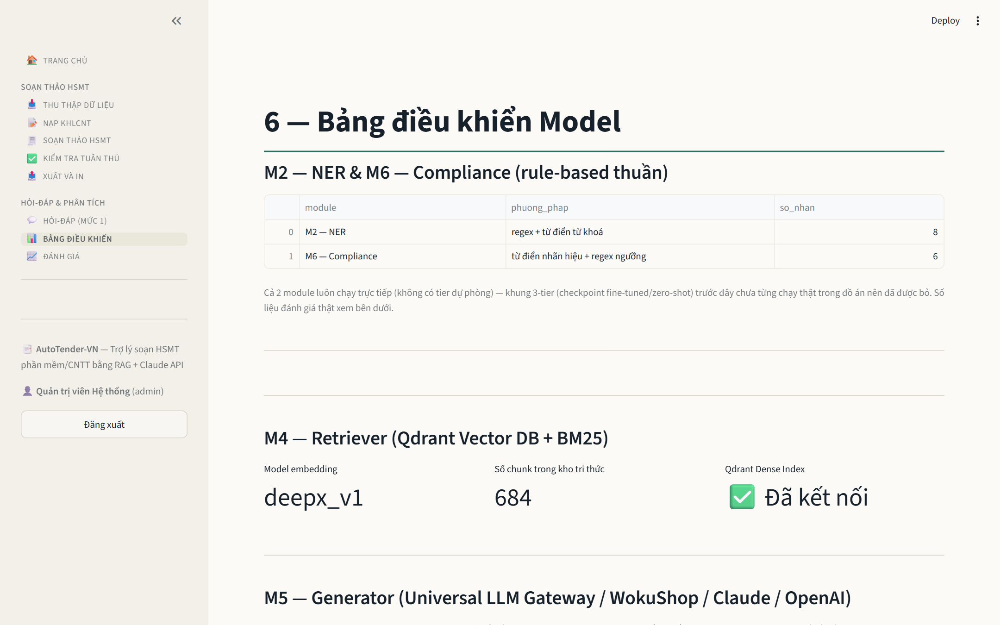
